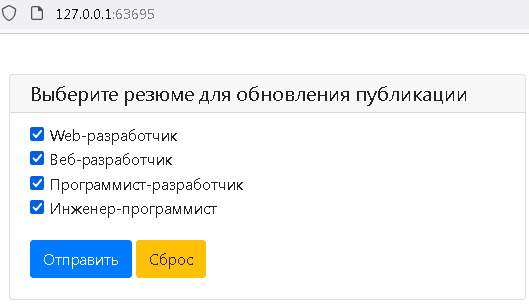

## dkxce HH Resume Updater 1.2

Приложение позволяет обновлять даты резюме на сайте hh.ru     

Работает через аргументы командной строки:   

- `-t` - (опционально) - ключ авторизации bearer token (выдается при запуске приложение без параметра -t)    
- `-r` - (опционально) - список идентификаторов резюме через запятую (выдается при работе приложения), либо все - `*`    

Например: -t "klhjsagsagsagsag" -r "asga1,asfgsaf2,sagasg3"     
Например: -t "klhjsagsagsagsag" -r "*"     

При первичной авторизации сохраняет `bearer token` в файл `HHResumeUpdater.token`.    
В дальнейшем ключ авторизации берет из файла.    
Если выдается ошибка аторизации - возможно срок действия bearer token истек, тогда удалите файл `HHResumeUpdater.token`.    

